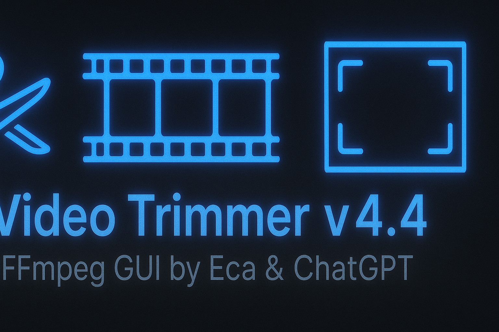

# 🎬 Video Trimmer v4.4
> A clean, drag-and-drop GUI for trimming video clips and exporting still frames — powered by FFmpeg.

---

  
  
  
  
  

  

---

## ✨ Features

- 🎞️ **Visual Trimming:** Load any video, scrub through frames, and mark precise start / end points.  
- ⚡ **GPU Acceleration:** Optional NVIDIA NVENC encoding for fast trimming.  
- 🖼️ **Export Still Frames:** Save numbered PNGs from any selected range — perfect for reference or animation work.  
- 🧩 **Drag-and-Drop Support:** Drop video files directly onto the window.  
- 🔍 **Cross-Platform & Lightweight:** Single Python + FFmpeg dependency, no install wizard needed.

---

## 🚀 Requirements

- **Python 3.10 or newer**  
- **FFmpeg** (must be in PATH or placed next to the script)  
- Optional: `pip install pillow opencv-python tkinterdnd2`

If FFmpeg isn’t detected, the app will offer to open the official download page.

---

## 🧰 Usage

1. Run `Video Trimmer.pyw` 
2. Click **Load Video** (or drag a file in).  
3. Move the slider to select your **start** / **end** frame.  
4. (Optional) check **Use GPU Encoder (NVENC)** for faster exports.  
5. (Optional) check **Export still frames from trim range** to save numbered PNGs.  
6. Click **Trim && Save**.  
   - A trimmed copy like `MyClip_trim_100_240.mp4` will appear beside your source.  
   - Still frames (if enabled) will appear in `frames_trim_100_240\` in the same folder.

---

